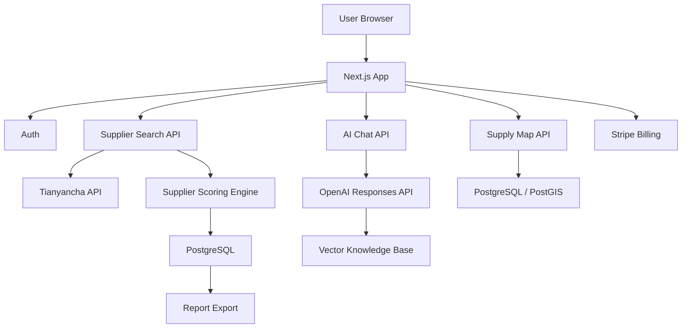

# ChinaSupply.ai 产品需求文档与技术方案

版本：v0.1  
日期：2026-05-01  
项目域名：Chinasupply.ai  
产品定位：面向全球采购商的中国供应链 AI 工作台

## 1. 项目一句话

ChinaSupply.ai 帮助海外买家更快判断中国供应商是否可信、是否适合合作、如何沟通、在哪里找产业带，并用 AI 把中国制造业语境转化成海外客户能理解和能执行的采购决策。

## 2. 核心机会

海外客户采购中国供应链时，最大的痛点通常不是“找不到供应商”，而是：

1. 看不懂中国企业信息，无法判断对方是工厂、贸易公司、工贸一体还是空壳公司。
2. 与中国销售、工厂、市场人员沟通时，字面翻译无法解释真实含义、谈判暗示、制造业语境。
3. 对中国不同地区的产业带不熟，不知道某类产品应该去浙江、广东、江苏、山东、福建、河北还是其他地区找。
4. 在阿里巴巴、1688、展会、独立站、社媒等渠道看到大量供应商，但缺少一个统一的判断、记录、比较、跟进工具。

因此，ChinaSupply.ai 不建议做成单一“企业查询网站”或单一“翻译机器人”，而应做成“供应链决策层 AI 产品”。企业信用查询、AI 沟通、选品和地图都是这个核心目标下的模块。

## 3. 建议产品架构

### 3.1 产品主线

建议将产品分为 4 个核心模块：

1. Supplier Check：供应商信用与类型判断
2. Trade Translator：制造业语境 AI 沟通助手
3. Supply Map：中国供应链产业带地图
4. Product Scout：AI 选品与供应商发现

其中 MVP 优先做前 3 个模块，Product Scout 放到第二阶段。原因是前 3 个模块更能建立品牌定位和数据资产，也更容易形成用户信任。

### 3.2 产品入口

首页不建议做普通企业官网，而是直接做工具型入口：

- 输入公司中文名、英文名、统一社会信用代码或官网域名，查询供应商。
- 粘贴一段中文/英文聊天内容，让 AI 解释含义并生成回复。
- 按产品关键词查看中国主要产业带地区。

首页第一屏应该让用户立刻使用，而不是只看介绍。

## 4. 功能需求

## 4.1 Supplier Check：供应商信用与类型判断

### 目标

帮助海外客户判断一个中国公司是否真实、是否可靠、是否可能是工厂或贸易公司，以及适合什么类型的合作。

### 数据来源

初期建议接入：

- 天眼查 API：企业工商信息、经营状态、注册资本、成立时间、法定代表人、股东、分支机构、司法风险、经营风险、知识产权、联系方式等。
- 企业官网解析：抓取官网文本、产品页、关于我们、工厂图片、资质证书等信息。
- 用户上传资料：营业执照、报价单、名片、产品目录、工厂照片、聊天记录。
- 可选扩展：海关数据、B2B 平台公开店铺信息、社媒主页、Google 搜索结果。

### 核心字段

- 公司名称
- 英文名称
- 统一社会信用代码
- 成立时间
- 注册资本
- 经营状态
- 注册地址
- 实际经营地址
- 经营范围
- 行业分类
- 股东结构
- 司法风险
- 经营异常
- 行政处罚
- 知识产权
- 进出口资质
- 网址与公开联系方式

### AI 判断逻辑

系统给出 4 类判断：

- Factory：更可能是工厂
- Trading Company：更可能是贸易公司
- Manufacturer + Trading：工贸一体
- Unclear / Need Verification：信息不足，需要进一步验证

建议不要只靠一个字段做判断，而是做评分模型。

工厂倾向信号：

- 经营范围包含生产、制造、加工、研发、设备、模具、注塑、五金、纺织、电子组装等关键词。
- 注册地址或实际地址位于工业园、产业园、厂区、镇级制造业集群。
- 官网有厂房、生产线、设备、车间、质检、认证、产能描述。
- 拥有生产相关专利、认证或环评信息。
- 公司名称包含 manufacturing、factory、industrial、technology、electronics、machinery 等相关词。

贸易公司倾向信号：

- 经营范围以进出口、批发、贸易、销售、货物及技术进出口为主。
- 注册地址为写字楼、商务中心、住宅、虚拟地址。
- 产品跨度过大且行业不相关。
- 官网大量使用平台通用图、缺少生产设备与工厂信息。
- 公司名称包含 trading、import/export、commerce、business 等相关词。

工贸一体倾向信号：

- 有生产制造信息，同时拥有进出口资质。
- 官网同时强调 factory 与 export service。
- 产品线集中，且存在自有品牌、质检、研发或生产能力描述。

### 输出结果

每次查询生成一份 Supplier Report：

- 供应商类型判断
- 信用风险等级：Low / Medium / High / Unknown
- 企业基础信息摘要
- 主要风险提示
- 适合合作方式：样品单、小批量、OEM、ODM、大货、代理采购等
- 建议向供应商继续追问的问题
- AI 英文解释，方便海外客户阅读
- 可导出 PDF

### 重要提醒

企业信用查询模块必须避免做出法律意义上的绝对结论。界面文案建议使用“AI assessment”“likely”“signals suggest”等表达，避免直接写“骗子”“不可信”等高风险判断。

## 4.2 Trade Translator：制造业语境 AI 沟通助手

### 目标

不是做普通翻译，而是做“采购沟通解释器”。它需要解释中国供应商话术背后的真实含义，并帮双方生成更自然、更专业、更符合制造业语境的回复。

### 主要场景

- 海外客户看不懂中国销售的真实意思。
- 中国供应商英文表达不清，客户误解。
- 客户想表达质量要求、交期、付款、样品、包装、认证、售后，但不知道怎么说更容易被中国工厂理解。
- 买卖双方因文化差异、谈判习惯、制造业术语产生误会。

### 核心功能

1. Chat Meaning Explainer
   - 用户粘贴中文或英文聊天内容。
   - AI 输出字面意思、真实含义、潜在风险、建议回复。

2. Buyer-to-Supplier Reply Generator
   - 用户用英文输入自己的意图。
   - AI 生成适合中国供应商理解的中文。
   - 同时保留专业、清楚、礼貌但有边界的语气。

3. Supplier-to-Buyer Translator
   - 将中国供应商的中文表达翻译成自然商业英文。
   - 解释其中隐含语境，例如“差不多”“可以做”“问题不大”“要看数量”“老板说价格做不了”等。

4. Manufacturing Context Mode
   - 支持按行业选择语境：服装、电子、五金、塑料、家具、包装、美妆、汽配、机械、建材等。
   - 根据行业补充 MOQ、模具费、打样、质检、交期、认证、包装、付款条款等解释。

5. Negotiation Assistant
   - 帮用户生成询价、催样品、砍价、确认交期、投诉质量、要求赔偿、确认订单细节等模板。

### 输出格式

建议每次输出包含：

- Clean Translation：自然翻译
- Real Meaning：真实含义解释
- Risk Signal：风险或误会点
- Suggested Reply：建议回复
- Tone：语气建议

## 4.3 Supply Map：中国供应链产业带地图

### 目标

做一个顶级界面的中国供应链地图，让海外客户直观看到：中国不同地区主要生产什么、哪些城市适合找哪些产品、产业优势是什么。

### 地图层级

1. 国家层：中国主要供应链总览
2. 省份层：广东、浙江、江苏、山东、福建、河北、河南、安徽、四川、重庆等
3. 城市层：深圳、东莞、广州、佛山、中山、义乌、宁波、温州、绍兴、苏州、无锡、青岛、泉州等
4. 产业带层：例如义乌小商品、深圳电子、佛山家具、东莞制造、宁波外贸、温州鞋服、绍兴纺织、泉州运动鞋服、中山灯具等

### 地图功能

- 按产品关键词搜索产业带
- 点击省份/城市查看主要行业
- 显示产业成熟度、供应商密度、出口经验、价格水平、质量水平、适合订单类型
- 显示相关展会、港口、物流优势
- 展示推荐查询：例如 “Where to source LED lights in China?”
- 与 Supplier Check 联动：查询公司时显示其所在地区产业背景

### 地图视觉建议

界面需要做到高端、国际化、工具感强：

- 深浅色都可，但建议以高对比、清晰地图、精致数据层为核心。
- 避免普通模板站风格。
- 地图应成为第一视觉焦点。
- 使用交互式图层、产业标签、热力点、城市详情侧栏。
- 移动端保留搜索优先，地图作为结果展示。

### 初期数据策略

第一版不必追求全国完整，可先建立 30-50 个重点产业带数据。每个产业带包含：

- 地区
- 中文名
- 英文名
- 主营产品
- 适合采购类型
- 典型 MOQ
- 价格水平
- 质量水平
- 出口成熟度
- 供应商密度
- 相关城市/港口
- 常见风险
- 推荐验证问题

## 4.4 Product Scout：AI 选品与供应商发现

### 目标

帮助海外客户基于趋势、利润、竞争、供应链成熟度、采购难度来筛选中国商品。

### 接入方向

你提到的“阿里鳌虾 API”需要进一步确认具体 API 名称、权限和商业使用条款。若可以稳定接入，建议作为第二阶段能力，不放在 MVP 第一优先级。

### 功能建议

- 输入目标市场、预算、品类、客单价、平台，例如 Amazon、Shopify、TikTok Shop、线下批发。
- AI 推荐产品方向。
- 展示中国主要供应地。
- 给出供应商筛选标准。
- 生成询价模板。
- 对比多个供应商报价、MOQ、交期、认证、包装能力。

### 为什么放第二阶段

选品功能需要更复杂的数据源和商业判断，早期容易做得宽而浅。建议先用 Supplier Check 和 Trade Translator 建立真实用户使用频率，再将用户查询行为沉淀为选品数据。

## 5. 用户角色

### 5.1 海外采购商

- 中小企业老板
- Amazon / Shopify / TikTok Shop 卖家
- 批发商
- 贸易商
- 品牌方采购经理
- 初次从中国采购的新手

核心需求：判断供应商、降低风险、提高沟通效率。

### 5.2 中国供应商

后期可开放供应商入驻：

- 工厂
- 工贸一体企业
- 外贸公司
- 产业带服务商

核心需求：获得海外询盘、展示可信信息、减少沟通误解。

### 5.3 平台运营人员

- 审核产业带数据
- 处理企业信息纠错
- 管理用户订阅
- 监控 API 成本
- 优化 AI 规则与提示词

## 6. MVP 范围

### MVP 建议包含

1. 首页工具入口
2. 用户注册/登录
3. 企业查询
4. 供应商类型判断
5. AI 供应商报告
6. 聊天内容翻译与语境解释
7. 基础供应链地图
8. 查询历史
9. 收藏供应商
10. 订阅付费

### MVP 不建议包含

- 全国所有产业带完整数据
- 复杂 CRM
- 供应商入驻后台
- 多 API 聚合海关数据
- 自动全网爬取
- 过早做完整选品系统

## 7. 商业模式

### 免费层

- 每月 3-5 次企业基础查询
- 每日有限 AI 翻译次数
- 可浏览基础供应链地图

### Pro 个人版

适合小卖家和个人采购：

- 更多企业查询额度
- 完整 AI 报告
- PDF 导出
- 聊天翻译历史
- 供应商收藏夹

建议价格：19-49 美元/月。

### Business 团队版

适合采购团队：

- 团队成员
- 共享供应商库
- 批量查询
- 报告导出
- 更高 AI 调用额度
- 客服支持

建议价格：99-299 美元/月。

### Enterprise 企业版

- API 接入
- 私有供应商数据库
- 自定义评分规则
- 数据合规支持
- 专属模型提示词

按年收费。

## 8. 推荐技术栈

以下技术选择基于 2026 年 5 月可用的官方文档与主流生产实践。具体版本在开发前应再次锁定。

### 前端

- Next.js App Router：主应用框架，适合 SEO、服务端渲染、工具型 SaaS 和国际化。
- React + TypeScript：提高长期维护性。
- Tailwind CSS：快速构建高质量界面。
- shadcn/ui：表单、弹窗、表格、菜单、Tabs 等基础组件。
- Mapbox GL 或 MapLibre GL：供应链地图、热力层、城市点位、交互图层。
- Recharts / ECharts：风险评分、企业画像、产业带数据图表。

### 后端

- Next.js Route Handlers / Server Actions：处理轻量 API、鉴权后的业务逻辑。
- Node.js + TypeScript：与前端统一语言。
- 后期复杂任务可拆出独立 Worker 服务。

### 数据库

- PostgreSQL：核心业务数据。
- Supabase：早期可快速获得 Postgres、Auth、Storage、Edge Functions。
- pgvector：存储产业带知识库、制造业术语、供应商报告向量，用于语义检索。
- Redis / Upstash：缓存企业查询结果、API 限流、热点地图数据。

### AI 能力

- OpenAI Responses API：用于多步骤推理、工具调用、报告生成、供应商判断。
- OpenAI Embeddings：用于产业带知识库、制造业术语库、聊天语境检索。
- Vercel AI SDK：用于流式聊天界面和 AI 交互体验。
- 多模型策略：高价值报告使用更强模型，普通翻译和摘要使用低成本模型。

### 第三方 API

- 天眼查 API：企业工商与风险信息。
- 支付：Stripe。
- 邮件：Resend。
- 文件存储：Supabase Storage 或 S3 兼容存储。
- 日志监控：Sentry。
- 产品分析：PostHog。

### 部署

- Vercel：部署 Next.js 前端与轻量后端。
- Supabase Cloud：数据库与认证。
- 独立 Worker：如果后期批量查询、爬取、PDF 生成、AI 报告任务变重，可部署到 Fly.io、Render、Railway 或云服务器。

## 9. 系统架构

## 10. 数据库核心表

### users

- id
- email
- name
- plan
- created_at

### companies

- id
- chinese_name
- english_name
- credit_code
- legal_person
- registered_capital
- established_date
- status
- address
- business_scope
- raw_data
- created_at
- updated_at

### supplier_reports

- id
- user_id
- company_id
- supplier_type
- risk_level
- score
- summary
- factory_signals
- trading_signals
- risk_signals
- suggested_questions
- report_json
- created_at

### chat_sessions

- id
- user_id
- title
- industry
- source_language
- target_language
- created_at

### chat_messages

- id
- session_id
- role
- content
- ai_analysis
- created_at

### supply_regions

- id
- province
- city
- district
- latitude
- longitude
- industries
- main_products
- supplier_density
- export_maturity
- quality_level
- price_level
- risks
- description

### saved_suppliers

- id
- user_id
- company_id
- notes
- tags
- created_at

### usage_logs

- id
- user_id
- feature
- token_count
- api_cost
- created_at

## 11. AI 提示词与知识库策略

### 11.1 系统提示词方向

Supplier Check 的 AI 不能只输出结论，必须输出“证据链”：

- 哪些字段支持工厂判断
- 哪些字段支持贸易公司判断
- 哪些字段存在不确定性
- 哪些信息需要人工进一步确认

Trade Translator 的 AI 要具备：

- 双语翻译
- 制造业术语解释
- 跨文化沟通解释
- 谈判语气控制
- 风险提醒

### 11.2 知识库内容

建议建立内部知识库：

- 中国制造业常见术语
- 常见贸易条款
- 付款方式解释
- MOQ、FOB、EXW、CIF、DDP 等术语
- 工厂常见话术解释
- 主要产业带介绍
- 各行业常见认证
- 各行业常见质量风险

## 12. 页面规划

### 12.1 首页

- 顶部搜索框：Check a Chinese supplier
- 快捷入口：Company Check / Chat Translator / Supply Map
- 示例查询
- 核心价值说明
- 价格入口

### 12.2 Supplier Check 页面

- 查询输入框
- 企业候选列表
- 企业基础信息
- AI 判断结果
- 风险评分
- 建议追问问题
- 导出 PDF
- 收藏按钮

### 12.3 Trade Translator 页面

- 左侧输入聊天内容
- 右侧输出翻译、真实含义、建议回复
- 行业选择
- 语气选择
- 一键复制中文回复/英文回复

### 12.4 Supply Map 页面

- 中国地图
- 产品搜索框
- 城市/产业带侧栏
- 热力层与筛选器
- 产业带详情
- 相关供应商查询入口

### 12.5 Dashboard

- 查询历史
- 收藏供应商
- 聊天历史
- 订阅状态
- API 使用额度

## 13. 开发阶段

### Phase 0：验证阶段，1-2 周

- 完成品牌定位
- 完成首页原型
- 完成供应商报告样例
- 完成 30 个产业带数据样例
- 完成天眼查 API 可行性测试

### Phase 1：MVP，4-8 周

- 用户系统
- 企业查询
- AI 供应商分类
- AI 报告
- 聊天翻译助手
- 基础地图
- 订阅支付

### Phase 2：增强版，8-12 周

- 批量查询
- PDF 报告
- 团队工作区
- 供应商比较
- 更多产业带数据
- 行业知识库增强

### Phase 3：平台化

- 中国供应商入驻
- Product Scout
- API 服务
- 浏览器插件
- CRM 集成
- 企业版私有数据

## 14. 关键风险

### 数据合规风险

企业信息、第三方 API、公开网页抓取都需要遵守数据源服务条款和地区合规要求。尤其面向海外用户时，要注意隐私政策、免责声明和数据使用边界。

### AI 判断风险

AI 不应做绝对信用背书。所有结论必须以“参考判断”形式呈现，并提供证据来源。

### API 成本风险

企业查询 API 和 AI 模型调用都可能产生较高成本。必须做：

- 查询缓存
- 用户额度限制
- 按功能计费
- 不同模型分层调用
- 报告复用

### 产品过宽风险

不要第一版同时做企业查询、翻译、地图、选品、供应商入驻、CRM。建议第一版围绕“判断供应商 + 理解沟通 + 了解产业带”建立清晰闭环。

## 15. 优先级建议

P0：

- 企业查询
- 供应商类型判断
- AI 报告
- 聊天翻译与语境解释
- 基础供应链地图
- 用户登录与额度控制

P1：

- PDF 导出
- 收藏供应商
- 查询历史
- 订阅支付
- 产业带搜索
- 行业知识库

P2：

- 批量查询
- 供应商对比
- Product Scout
- 浏览器插件
- 供应商入驻
- API 服务

## 16. 品牌与差异化

ChinaSupply.ai 的差异化不应是“又一个 AI 翻译”或“又一个企业查询网站”，而是：

> The AI sourcing intelligence platform for buying from China.

中文可表达为：

> 面向全球买家的中国供应链 AI 决策平台。

核心护城河：

- 中国企业数据理解
- 制造业语境理解
- 产业带知识库
- 供应商风险判断规则
- 海外采购工作流

## 17. 推荐第一版首页文案

英文主标题：

China Supplier Intelligence, Powered by AI

副标题：

Check Chinese companies, understand supplier messages, and discover where products are made across China.

三个入口：

- Check a Supplier
- Translate Supplier Chats
- Explore China Supply Map

## 18. 参考官方文档

- Next.js App Router 官方文档：https://nextjs.org/docs/app
- Supabase pgvector 官方文档：https://supabase.com/docs/guides/database/extensions/pgvector
- Supabase 自动 Embeddings 官方文档：https://supabase.com/docs/guides/ai/automatic-embeddings
- OpenAI API 模型文档：https://developers.openai.com/api/docs/models/all/
- Vercel AI SDK 官方介绍：https://vercel.com/blog/introducing-the-vercel-ai-sdk

## 19. 结论

建议将 ChinaSupply.ai 做成“海外客户采购中国供应链时的 AI 决策入口”。第一阶段不要贪大，先把三个高频痛点做到极致：

1. 这个供应商到底是什么类型？
2. 这段中国供应商的话到底是什么意思？
3. 这个产品应该去中国哪里找？

只要这三个问题回答得足够专业，ChinaSupply.ai 就有机会从工具产品成长为供应链数据平台。
