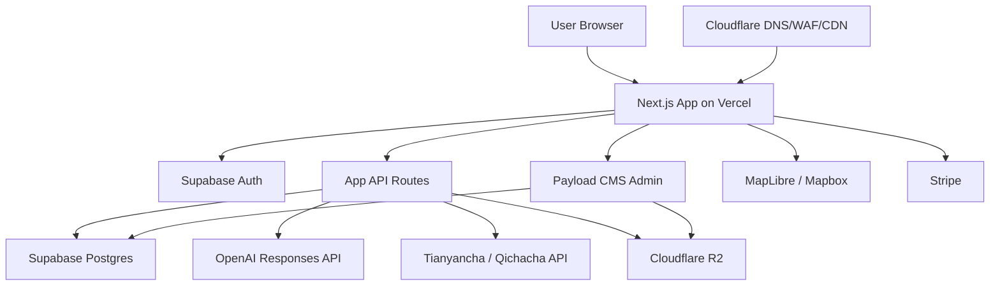

# ChinaSupply.ai 第一版技术架构文档

版本：v0.1  
日期：2026-05-01  
目标：确定 ChinaSupply.ai 第一版可落地、可扩展、可付费上线的技术框架

## 1. 结论

第一版建议采用：

- Next.js + React + TypeScript 作为主应用框架
- Payload CMS 作为后台内容管理与运营管理系统
- Supabase Postgres 作为主数据库
- Cloudflare R2 作为 S3-compatible 文件存储
- Cloudflare 作为 DNS、CDN、安全防护与 Turnstile 人机验证
- Vercel 作为前端和轻量后端部署平台
- Tailwind CSS + shadcn/ui 作为 UI 基础
- MapLibre GL 或 Mapbox GL 作为供应链地图引擎
- ECharts / Recharts 作为数据可视化
- OpenAI Responses API + Vercel AI SDK 作为 AI 能力层

你的技术方向是合理的。需要优化的地方是：第一版不要把 Payload CMS 当成全部后端，也不要让 Supabase 和 Payload 在用户权限、业务数据、文件管理上互相打架。最佳方式是明确职责边界。

## 2. 第一版推荐架构



## 3. 技术选型确认

### 3.1 主框架：Next.js + React + TypeScript

建议第一版使用 Next.js，而不是单独的 Vite React SPA。

原因：

- 适合部署到 Vercel。
- 支持服务端渲染和 SEO，对 `China supplier check`、`China supply map` 等关键词有价值。
- 可以同时承载前台页面、API Routes、AI streaming、Payload CMS。
- TypeScript 有利于长期维护企业查询、AI 报告、地图数据等复杂结构。

推荐：

- Next.js App Router
- React
- TypeScript
- pnpm

### 3.2 CMS：Payload CMS

Payload CMS 适合用来管理：

- 首页文案
- 多语言内容
- 产业带数据
- 行业分类
- FAQ
- Blog / SEO 内容
- AI 提示词模板
- 供应商评分规则
- 地图点位与城市资料
- 管理员后台

不建议第一版用 Payload 直接管理所有前台用户业务流程，例如订阅、查询额度、AI 聊天记录、支付订单等。这些更适合放在应用业务数据库和专门的业务 API 中。

推荐职责：

- Payload CMS：运营后台和可编辑内容
- Supabase：主业务数据、用户数据、查询记录、AI 报告、权限、向量知识库

### 3.3 数据库：Supabase Postgres

Supabase Postgres 作为主数据库是合适的。

第一版建议使用 Supabase 提供：

- PostgreSQL
- Auth
- pgvector
- Edge Functions 可选
- 数据库备份
- SQL 管理

需要注意：

- 暴露给前端访问的表必须开启 RLS。
- `service_role` 只能放在服务端环境变量，绝不能暴露到浏览器。
- Payload CMS 使用数据库时，要避免和前台业务表权限模型混乱。

推荐数据分区：

- `app_*`：应用业务表，例如用户查询、报告、收藏、聊天记录。
- `cms_*` 或 Payload 默认表：内容管理表。
- `ai_*`：AI 提示词、知识库、向量数据。
- `billing_*`：订阅、额度、支付事件。

### 3.4 文件存储：Cloudflare R2

你提到的 S3 可以第一版直接用 Cloudflare R2 来实现。R2 提供 S3-compatible API，适合：

- 用户上传营业执照、报价单、聊天截图
- AI 报告 PDF
- Payload CMS 媒体文件
- 地图素材
- 产业带图片

为什么建议 R2：

- 与 Cloudflare CDN、安全体系配合好。
- 没有传统云对象存储常见的高额出站流量费用。
- 可通过 S3 SDK 或 Payload S3 storage plugin 接入。

注意：

- 私密文件必须使用签名 URL 或后端代理下载。
- 不要把用户上传的企业资料放在公开 bucket。
- 文件 metadata 要存入 Supabase，方便权限控制和审计。

### 3.5 Cloudflare

Cloudflare 第一版负责：

- DNS
- CDN
- WAF
- Bot 防护
- Turnstile 人机验证
- R2 对象存储
- Cache Rules
- Rate Limiting

建议：

- `chinasupply.ai` 指向 Vercel。
- `assets.chinasupply.ai` 或 `files.chinasupply.ai` 指向 R2 公开资源。
- 私密文件不要直接公开绑定域名。

### 3.6 Vercel

Vercel 第一版负责：

- Next.js 前台应用部署
- API Routes / Route Handlers
- AI streaming
- Preview Deployments
- 环境变量管理
- Cron 可选

注意：

- 重任务不要放在 Vercel request 生命周期里长期运行。
- 批量企业查询、批量报告、PDF 大规模生成后期应拆到 Worker。
- Payload 在 Vercel 上运行时，文件上传必须进入 R2，而不是依赖本地文件系统。

### 3.7 UI：Tailwind CSS + shadcn/ui

这是第一版最合适的组合。

Tailwind CSS 用于：

- 快速实现高质量界面
- 统一设计 tokens
- 响应式布局

shadcn/ui 用于：

- 表单
- 弹窗
- 表格
- Tabs
- Dropdown
- Command palette
- Toast
- Dialog
- Sheet

建议第一版建立自己的设计系统：

- `Button`
- `Input`
- `Card`
- `DataTable`
- `RiskBadge`
- `SupplierTypeBadge`
- `ScoreGauge`
- `MapPanel`
- `ReportSection`

### 3.8 地图：MapLibre GL 优先，Mapbox GL 备选

第一版建议优先 MapLibre GL。

原因：

- 开源，成本更可控。
- 适合自定义中国地图数据、产业带点位、热力层。
- 后续可接 MapTiler、Protomaps 或自建 tiles。

如果你追求最快做出顶级视觉，也可以用 Mapbox GL：

- 地图样式成熟
- 视觉效果好
- 开发体验更快
- 但有 token、价格和商业依赖

建议策略：

- MVP：MapLibre GL + GeoJSON + 自定义样式
- 如果视觉效果不够，再切 Mapbox GL

### 3.9 图表：ECharts 为主，Recharts 为辅

建议：

- ECharts：复杂图表、地图辅助图层、雷达图、热力图、风险评分图
- Recharts：简单 dashboard 折线图、柱状图、面积图

第一版如果想减少依赖，可以只选 ECharts。

## 4. 第一版模块架构

## 4.1 Supplier Check 模块

### 流程

1. 用户输入公司名称、统一社会信用代码、英文名或官网。
2. 系统先查本地缓存。
3. 缓存未命中时调用天眼查或企查查。
4. 标准化企业数据。
5. 存入 Supabase。
6. 调用 AI 评分引擎。
7. 生成 Supplier Report。
8. 返回前端展示。

### 技术组件

- Next.js API Route：`/api/supplier/search`
- Supabase：企业数据、查询记录、报告
- Redis / Upstash：查询缓存与限流，可第二阶段加入
- OpenAI：供应商类型判断、风险解释、建议追问问题
- Payload：评分规则、行业词库、运营可编辑提示词

## 4.2 Trade Translator 模块

### 流程

1. 用户粘贴聊天内容。
2. 选择行业、目标语言、语气。
3. 系统检索制造业术语库。
4. 调用 OpenAI 生成翻译、真实含义、风险提醒、建议回复。
5. 保存聊天历史。

### 技术组件

- Vercel AI SDK：流式输出
- OpenAI Responses API
- Supabase：聊天 session 与消息
- pgvector：制造业语境知识库
- Payload：提示词、行业术语内容管理

## 4.3 Supply Map 模块

### 流程

1. 前端加载中国地图基础 GeoJSON 或 tiles。
2. 从 API 获取产业带点位和行业数据。
3. 用户搜索产品关键词。
4. 系统返回相关城市、产业带、供应商查询入口。

### 技术组件

- MapLibre GL
- Supabase Postgres，可后期启用 PostGIS
- Payload：产业带内容后台
- ECharts：产业对比与评分图表

## 4.4 Admin / CMS 模块

Payload CMS 管理内容：

- 城市
- 产业带
- 行业
- 产品分类
- SEO 页面
- Blog
- FAQ
- Prompt templates
- Supplier scoring rules
- Risk signal definitions

管理员角色：

- Super Admin
- Content Editor
- Data Reviewer
- Support

## 5. 数据库设计边界

### 5.1 Supabase 负责

- 前台用户
- 用户套餐
- 查询额度
- 企业查询记录
- 企业标准化数据
- AI 报告
- 聊天记录
- 收藏供应商
- 支付事件
- 文件 metadata
- 向量知识库

### 5.2 Payload 负责

- 后台管理员
- 内容页面
- 产业带资料
- 运营配置
- AI 提示词模板
- 风险规则内容
- CMS 媒体

### 5.3 推荐表

核心业务表：

- `users_profile`
- `companies`
- `company_api_snapshots`
- `supplier_reports`
- `supplier_report_evidence`
- `chat_sessions`
- `chat_messages`
- `saved_suppliers`
- `usage_logs`
- `billing_subscriptions`
- `billing_events`
- `files`
- `ai_knowledge_documents`
- `ai_knowledge_embeddings`
- `supply_regions`
- `supply_industries`

## 6. 天眼查 / 企查查 API 是否可以随便调用？

结论：不可以。

天眼查、企查查这类企业信息 API 一般属于商业开放平台能力，不是公开免费网站接口。通常需要：

- 注册开放平台账号
- 企业认证或商务开通
- 购买 API 套餐或签订合同
- 获得 AppKey / SecretKey / Token
- 按接口授权调用
- 遵守 QPS、日调用量、并发限制
- 遵守数据缓存、展示、再分发、导出、终端用户使用等条款

企查查开放平台官网展示了企业工商、企业工商详情、企业模糊搜索、裁判文书、失信、被执行人、商标、专利、软著、备案网站等不同 ApiCode，说明它是按接口能力开放，而不是一个 key 可以无限调用全部数据。

天眼查也有开放平台和企业信息 API，但实际接口权限、价格、可调用字段、可缓存范围，需要以你签约账号后台和合同条款为准。

### 第一版合规建议

1. 只使用官方开放平台，不使用爬虫、逆向接口、第三方灰色代理。
2. 用户每次查询前，在服务条款中说明企业数据来源和 AI 判断性质。
3. 不向用户承诺数据 100% 准确。
4. 不把原始 API 数据大规模公开展示或二次售卖，除非合同允许。
5. 对 API 结果做缓存前，确认合同是否允许缓存以及缓存周期。
6. 对导出 PDF 报告加免责声明。
7. 高风险结论使用 “likely / signals suggest / needs verification”，避免绝对定性。
8. 后端调用 API，不能在前端暴露 API key。
9. 对每个用户做额度限制，避免被刷导致 API 成本失控。

### 建议优先对接哪一个？

第一版建议优先选一个 API 源，不要同时接两个。

选择标准：

- 是否支持英文合同或海外业务使用
- 是否允许面向海外用户展示结果
- 是否允许缓存
- 是否允许报告导出
- 是否有企业模糊搜索
- 是否有工商详情、司法风险、经营异常、知识产权
- 价格是否适合 SaaS 按次查询模式
- QPS 和稳定性
- 是否提供正式发票和技术支持

如果企查查商务响应快、接口文档清楚，可以先用企查查；如果天眼查给的数据维度和授权更适合你的报告产品，也可以先用天眼查。技术上要做成 Provider Adapter，方便之后切换或双源校验。

## 7. API Provider Adapter 设计

不要在业务代码里直接写死天眼查或企查查字段。建议抽象为：

```ts
interface CompanyDataProvider {
  searchCompanies(keyword: string): Promise<CompanySearchResult[]>
  getCompanyDetail(companyIdOrCode: string): Promise<CompanyDetail>
  getRiskInfo(companyIdOrCode: string): Promise<CompanyRiskInfo>
  getIntellectualProperty(companyIdOrCode: string): Promise<CompanyIPInfo>
}
```

实现：

- `QichachaProvider`
- `TianyanchaProvider`
- `MockCompanyProvider`

第一版先用 `MockCompanyProvider` 做 UI 和 AI 报告开发，再接真实 API。这样可以避免 API 尚未签约时卡住产品开发。

## 8. 安全架构

### 8.1 认证

建议第一版：

- 前台用户：Supabase Auth
- 后台管理员：Payload Auth

这样后台和前台隔离更清楚。

### 8.2 权限

- Supabase 业务表开启 RLS。
- 后台管理只允许管理员访问。
- API Routes 对用户身份、套餐、额度做校验。
- 文件下载必须检查文件归属。

### 8.3 API Key 管理

所有敏感 key 放在 Vercel 环境变量：

- `SUPABASE_SERVICE_ROLE_KEY`
- `OPENAI_API_KEY`
- `QICHACHA_APP_KEY`
- `QICHACHA_SECRET_KEY`
- `TIANYANCHA_TOKEN`
- `R2_ACCESS_KEY_ID`
- `R2_SECRET_ACCESS_KEY`
- `STRIPE_SECRET_KEY`

浏览器只允许使用公开安全变量：

- `NEXT_PUBLIC_SUPABASE_URL`
- `NEXT_PUBLIC_SUPABASE_PUBLISHABLE_KEY`
- `NEXT_PUBLIC_MAPBOX_TOKEN`，如果使用 Mapbox

## 9. 缓存与成本控制

第一版必须做成本控制：

- 企业查询结果缓存
- 同一个公司重复查询复用报告
- AI 报告按需生成
- 免费用户限制查询次数
- 付费用户按套餐限制
- 对同 IP、同用户、同关键词限流
- 后台记录每次 API 成本和 AI token 成本

推荐：

- MVP：Supabase 表缓存即可
- Phase 2：加入 Upstash Redis

## 10. 推荐环境变量

```bash
NEXT_PUBLIC_APP_URL=

NEXT_PUBLIC_SUPABASE_URL=
NEXT_PUBLIC_SUPABASE_PUBLISHABLE_KEY=
SUPABASE_SERVICE_ROLE_KEY=

DATABASE_URL=
PAYLOAD_SECRET=

OPENAI_API_KEY=

QICHACHA_APP_KEY=
QICHACHA_SECRET_KEY=
TIANYANCHA_TOKEN=

R2_ACCOUNT_ID=
R2_BUCKET=
R2_ACCESS_KEY_ID=
R2_SECRET_ACCESS_KEY=
R2_PUBLIC_URL=

STRIPE_SECRET_KEY=
STRIPE_WEBHOOK_SECRET=

CLOUDFLARE_TURNSTILE_SITE_KEY=
CLOUDFLARE_TURNSTILE_SECRET_KEY=
```

## 11. 第一版开发顺序

### Step 1：项目基础

- 初始化 Next.js + TypeScript
- 配置 Tailwind CSS
- 配置 shadcn/ui
- 配置 Supabase client
- 配置 Payload CMS
- 配置 R2 storage

### Step 2：核心数据模型

- 用户 profile
- 查询记录
- 企业数据
- AI 报告
- 聊天记录
- 产业带数据
- 使用额度

### Step 3：Mock API

- 用 MockCompanyProvider 模拟天眼查/企查查返回
- 完成 Supplier Check UI
- 完成 AI 报告格式

### Step 4：AI 模块

- Supplier scoring prompt
- Trade translator prompt
- 产业带知识库
- 流式输出

### Step 5：地图模块

- MapLibre GL 中国地图
- 产业带点位
- 搜索与筛选
- 城市详情侧栏

### Step 6：真实 API 对接

- 签约天眼查或企查查
- 接入 Provider Adapter
- 加缓存、限流、错误处理
- 检查合同中的展示和缓存边界

### Step 7：付费与上线

- Stripe 订阅
- 免费额度
- Pro 套餐
- 查询成本监控
- Cloudflare WAF / Turnstile
- Vercel Production 部署

## 12. 版本基线

需要确定版本号，但建议采用“基线版本 + lockfile + 定期升级”的策略，而不是在文档里永久写死所有补丁版本。

原因：

- Next.js、Payload、Supabase、Tailwind、AI SDK 都更新很快。
- 生产环境不能使用 `latest` 漂移安装，否则本地、GitHub Actions、Vercel 可能装出不同依赖。
- 第一版需要可复现构建，便于排查线上问题。

### 12.1 第一版推荐版本

以下版本为 2026-05-01 查询 npm registry 得到的可用版本，正式初始化项目时应再次确认一次。

| 类型 | 推荐版本 |
|---|---:|
| Node.js | 24 LTS |
| Next.js | 16.2.4 |
| React | 19.2.5 |
| React DOM | 19.2.5 |
| TypeScript | 6.0.3 |
| Payload CMS | 3.84.1 |
| @payloadcms/next | 3.84.1 |
| @payloadcms/db-postgres | 3.84.1 |
| @payloadcms/storage-s3 | 3.84.1 |
| Tailwind CSS | 4.2.4 |
| @supabase/supabase-js | 2.105.1 |
| @supabase/ssr | 0.10.2 |
| MapLibre GL | 5.24.0 |
| ECharts | 6.0.0 |
| Recharts | 3.8.1 |
| Vercel AI SDK `ai` | 6.0.172 |
| OpenAI Node SDK | 6.35.0 |
| Stripe Node SDK | 22.1.0 |

### 12.2 版本策略

建议：

- 使用 `pnpm` 作为包管理器。
- 提交 `pnpm-lock.yaml` 到 GitHub。
- `package.json` 中核心框架依赖可以先锁定精确版本。
- 小工具类依赖可以使用兼容版本范围，但上线前以 lockfile 为准。
- Vercel 构建使用 `pnpm install --frozen-lockfile`。
- GitHub Actions 也使用 lockfile 安装。
- 每 2-4 周统一升级一次依赖，不要每天追最新版本。
- 安全更新可以通过 Dependabot 或 Renovate 单独提 PR。

建议在 `package.json` 中声明：

```json
{
  "engines": {
    "node": "24.x"
  },
  "packageManager": "pnpm@latest"
}
```

如果 Payload 或 Next.js 模板在初始化时对 TypeScript 版本有特殊要求，以官方模板生成结果为准。原则是：不要为了追最新 TypeScript 破坏框架兼容性。

## 13. GitHub 与部署策略

代码应该部署在 GitHub，并通过 GitHub 连接 Vercel 自动部署。

### 13.1 推荐仓库结构

第一版建议使用单仓库：

```text
ChinaSupply/
  apps/
    web/
  packages/
    config/
    database/
    ui/
  docs/
  supabase/
  .github/
    workflows/
```

如果第一版想更简单，也可以先不用 monorepo：

```text
ChinaSupply/
  src/
  payload.config.ts
  supabase/
  docs/
  .github/
```

建议第一版优先简单结构，等出现独立 Worker、浏览器插件、API SDK 时再升级 monorepo。

### 13.2 分支策略

推荐：

- `main`：生产环境分支，对应 Vercel Production。
- `develop`：开发集成分支，对应 Vercel Preview。
- `feature/*`：具体功能分支。

流程：

1. 从 `develop` 创建功能分支。
2. 提 PR 到 `develop`。
3. GitHub Actions 跑类型检查、lint、test、build。
4. Vercel 自动生成 Preview URL。
5. 验收后合并到 `develop`。
6. 需要上线时从 `develop` 提 PR 到 `main`。
7. 合并 `main` 后 Vercel 自动发布 Production。

### 13.3 GitHub Actions

第一版至少需要：

- TypeScript typecheck
- ESLint
- Unit tests
- Build check

建议 workflow：

```yaml
name: CI

on:
  pull_request:
  push:
    branches: [main, develop]

jobs:
  ci:
    runs-on: ubuntu-latest
    steps:
      - uses: actions/checkout@v4
      - uses: pnpm/action-setup@v4
      - uses: actions/setup-node@v4
        with:
          node-version: 24
          cache: pnpm
      - run: pnpm install --frozen-lockfile
      - run: pnpm lint
      - run: pnpm typecheck
      - run: pnpm test
      - run: pnpm build
```

### 13.4 Vercel 部署

Vercel 项目直接连接 GitHub 仓库。

推荐设置：

- Production Branch：`main`
- Preview Branches：所有 PR 和 `develop`
- Install Command：`pnpm install --frozen-lockfile`
- Build Command：`pnpm build`
- Output：Next.js 默认
- Node.js Version：24.x

环境变量分三套：

- Development：本地 `.env.local`
- Preview：Vercel Preview 环境变量
- Production：Vercel Production 环境变量

敏感变量只放 Vercel / GitHub Secrets，不提交到 GitHub。

### 13.5 GitHub Secrets

GitHub Actions 里只放 CI 必要的变量。真实生产密钥优先放 Vercel。

可能需要：

- `SUPABASE_ACCESS_TOKEN`
- `SUPABASE_PROJECT_REF`
- `VERCEL_TOKEN`
- `VERCEL_ORG_ID`
- `VERCEL_PROJECT_ID`

如果只使用 Vercel GitHub Integration 自动部署，可以不在 GitHub Actions 里放 Vercel token。

### 13.6 数据库迁移

Supabase 数据库变更必须走 migration：

- 本地开发生成 migration
- 提交 migration 文件到 GitHub
- CI 检查 migration
- 上线前在 Supabase Preview / Staging 验证
- Production 手动或自动执行 migration

不要直接在生产 Supabase 控制台手改表结构后忘记同步代码。

## 14. 最终建议

第一版技术框架定为：

> Next.js + Payload CMS + Supabase Postgres/Auth/pgvector + Cloudflare R2 + Cloudflare DNS/WAF/CDN + Vercel + OpenAI + MapLibre GL + Tailwind CSS + shadcn/ui。

其中：

- Payload 管运营后台和内容。
- Supabase 管业务数据和用户数据。
- R2 管文件。
- Vercel 管应用部署。
- Cloudflare 管域名、安全、CDN、R2。
- OpenAI 管供应商判断和制造业语境理解。
- 企查查或天眼查只通过官方开放平台调用，不能随便调用，也不能绕过合同规则缓存或二次分发数据。

这个组合适合第一版快速上线，也能支撑后续做团队版、批量查询、供应链地图、知识库和企业 API。

## 15. 参考资料

- Payload 官方 Get Started：https://payloadcms.com/get-started
- Payload 官方 Production Deployment：https://payloadcms.com/docs/production/deployment/
- Payload + Supabase 官方指南：https://payloadcms.com/posts/guides/setting-up-payload-with-supabase-for-your-nextjs-app-a-step-by-step-guide
- Supabase Row Level Security：https://supabase.com/docs/guides/database/postgres/row-level-security
- Cloudflare R2 S3 compatibility：https://developers.cloudflare.com/r2/api/s3/api/
- Cloudflare R2 产品页：https://workers.cloudflare.com/product/r2
- 企查查开放平台：https://openapi.qcc.com/
- Node.js Release Schedule：https://github.com/nodejs/Release
